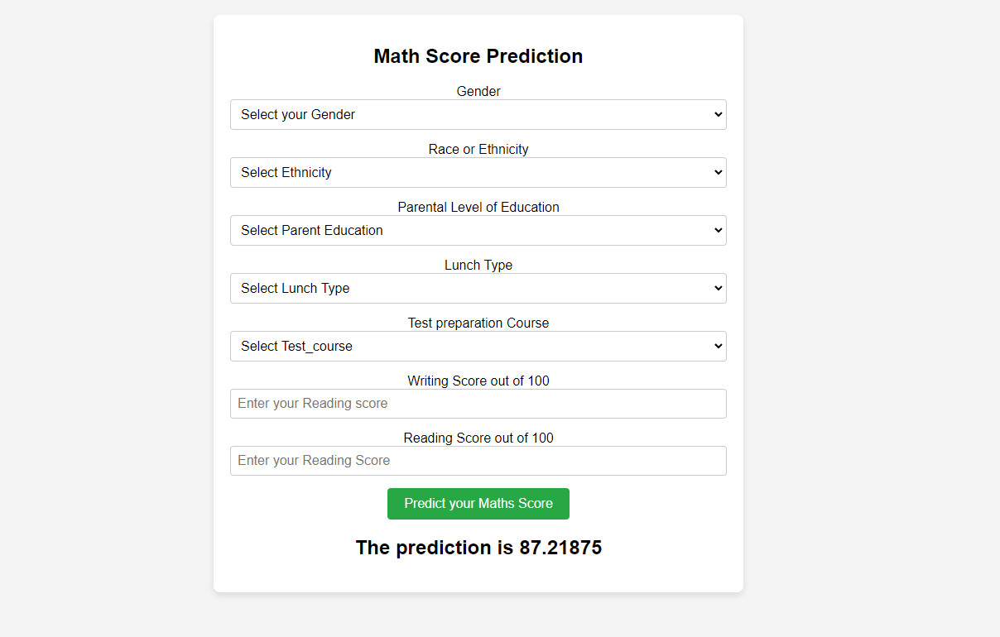

# End-to-End Machine Learning Project

This repository contains an end-to-end machine learning project that that predicts math scores based on writing score, reading score, ethnicity, and parent's level of education.



## Project Structure

```
|-- artifacts/
    |-- model.pkl                # Trained machine learning model
    |-- preprocessor.pkl         # Data preprocessing pipeline or object
    |-- raw.csv                  # Raw data file
    |-- train.csv                # Processed training data file
    |-- test.csv                 # Processed testing data file
|-- notebook/
    |-- data/
         |-- stud.csv                        # Raw data file
    |-- 1. EDA STUDENT PERFORMANCE .ipynb    # Exploratory Data Analysis notebook
    |-- 2. MODEl TRAINING.ipynb              # Model training notebook
|-- src/
    |-- components
         |-- data_ingestion.py      # Module for data loading and ingestion
         |-- data_transformation.py # Module for data transformation and preprocessing
         |-- model_trainer.py       # Module for training the machine learning model
    |-- pipeline
         |-- predict_pipeline.py    # Module for making predictions
         |-- train_pipeline.py      # Module for training pipeline
    |-- exception.py                # Custom exception classes
    |-- logger.py                   # Logging configuration and utility
    |-- utils.py                    # Utility functions
|-- templates/
    |-- home.html                   
    |-- index.html                  
|-- requirements.txt                # List of required packages
|-- README.md                       
|-- setup.py                        # Script for packaging and distribution
|-- application.py                  # Main application script for deployment
```

## Overview

This project aims to build a machine learning model for student's math score prediction. The project is divided into the following main steps:

1. **Data Preparation**:
   
This step involves loading, cleaning, and preparing the raw data for further processing.
   - `src/components/data_ingestion.py`
   

2. **Data Transformation**:

In this step, we utilize normalization and one hot encoding for numerical and categorical data.
   - `src/components/data_transformation.py`
   

3. **Model Training**:
   - `src/components/model_trainer.py`
   - Here, we select a suitable machine learning algorithm, train it on the preprocessed data, and save the trained model.

4. **Deployment**:
   - `application.py`
   - We deploy the trained model using a Flask web application and AWS Elastic Beanstalk, allowing users to interact with it.

## Getting Started

To get started with this project, follow these steps:

1. Clone the repository:
   ```
   git clone https://github.com/huzaifi18/mlproject.git
   cd mlproject
   ```

2. Install the required packages:
   ```
   pip install -r requirements.txt
   ```

3. Follow the notebooks in the `notebooks/` directory in the specified order.

4. Run `application.py`:
   ```
   python application.py
   ```

5. Access the web application at `http://localhost:5000` in your web browser.

## License

This project is licensed under the [MIT License](LICENSE.txt).
